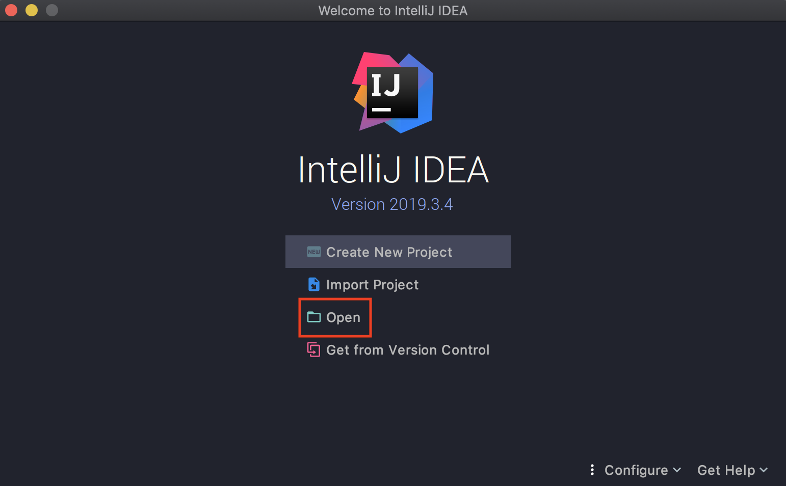
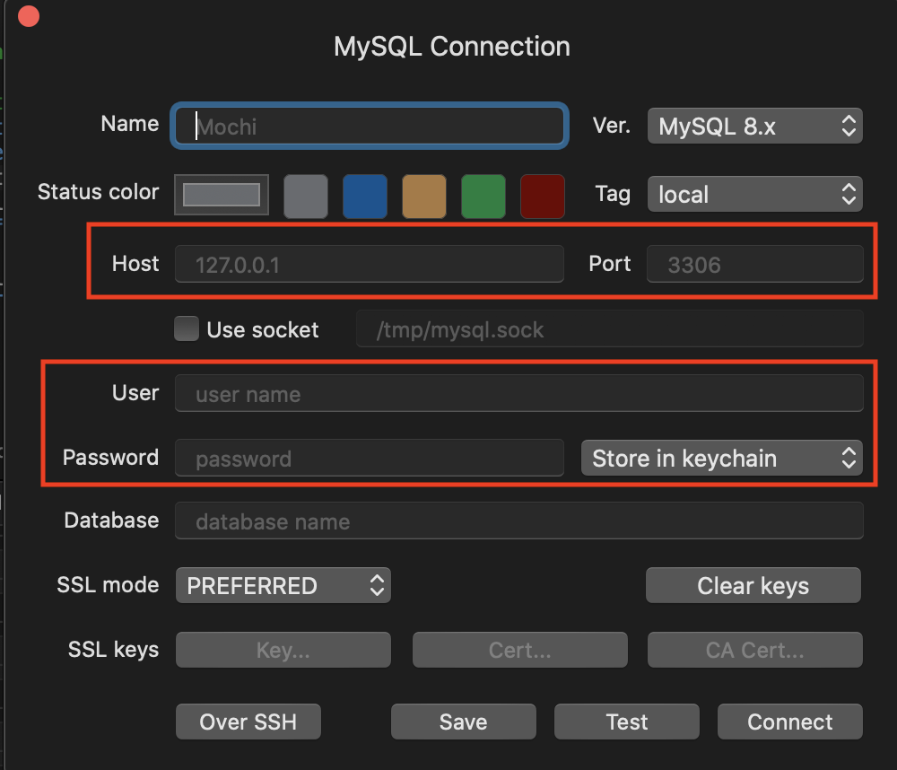
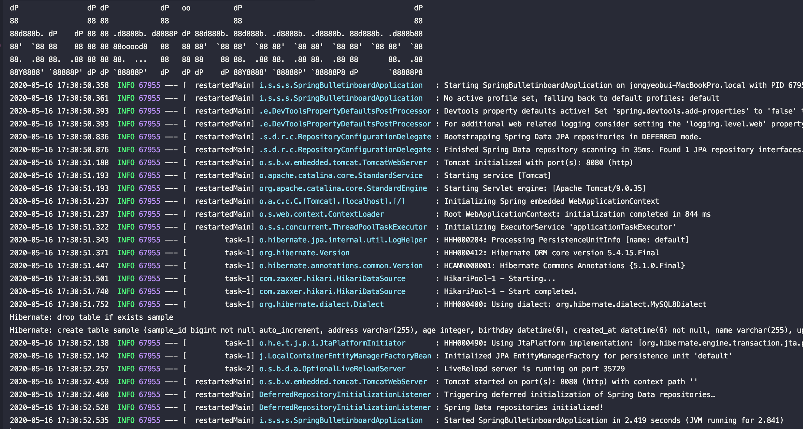
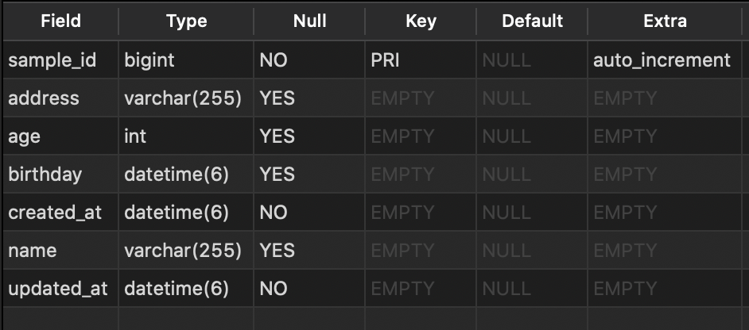
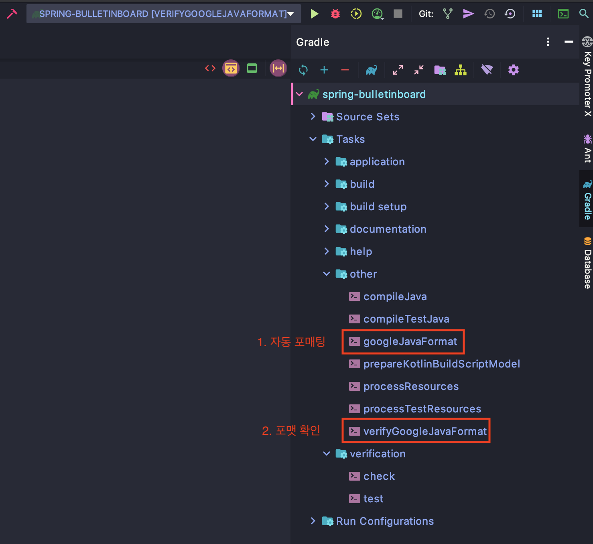

# 스프링 게시판 프로젝트

2020.05.16 ~

## 프로젝트 요구사항

[요구사항 정의 문서](./docs/requirement.md)를 확인한다.
<br />
`/docs/requirement.md` 경로에 저장되어 있는 파일이다.

## 개발 환경
- JDK8
- Spring Boot 2.3.0
- Spring data JPA
- Hibernate 5.4.15
- Freemarker 2.3.30
- embedded Tomcat 9.0.35
- IDE
   - IntelliJ
- MySQL 8


## 프로젝트 초기 설정
### 1. 프로젝트 오픈

<div align="center">
    
</div>

`spring-bulletinboard` 폴더가 저장된 디렉토리 선택한다. 프로젝트를 오픈하면 자동으로 Gradle 의존성이 추가된다.


### 2. MySQL 설치 및 연결


[MySQL 다운로드 페이지](https://dev.mysql.com/downloads/mysql/5.5.html?os=3&version=5)에서 MySQL 8.0.20을 설치한다.

각자 원하는 툴을 이용해 Mysql에 연결한다.

<div align="center">
    
</div>

```shell
// 커맨드로 연결하는 방법
mysql -u {username} -p
```

Host는 기본적으로 127.0.0.1(localhost), Port는 3306이다.
설치할 때 설정한 `username`과 `password`를 입력한다.

연결이 완료되면 .SQL 스크립트를 하나 만들고 다음 명령을 입력한다.

```sql
create database bulletinboard;  -- bulletinboard 데이터베이스 생성
use bulletinboard;  -- bulletinboard 데이터베이스 사용
```

### 3. 프로젝트 실행

<div align="center">
    
</div>

프로젝트가 정상적으로 실행되면 위 이미지와 같이 결과가 나온다. 8080 포트로 정상 동작하고 있는 모습이다.

```
Hibernate: create table sample (sample_id bigint not null auto_increment, address varchar(255), age integer, birthday datetime(6), created_at datetime(6) not null, name varchar(255), updated_at datetime(6) not null, primary key (sample_id)) engine=InnoDB
```

JPA에 의해서 정의된 엔티티들이 DDL로 생성된다. MySQL로 가서 자동으로 생성된 테이블을 확인할 수 있다.

```sql
-- MySQL에서 입력한다.
show tables;
desc sample;
```

<div align="center">
    
</div>


### 4. java formatting

google java format 플러그인을 이용해서 코딩 컨벤션을 일치시킨다. 개행, 띄어쓰기, 주석 등등 규칙 없이 하다보면 컨벤션이 깨지게 된다.
<br />
자동 포매터를 이용해서 항상 `git push` 전에 자동 포매팅을 한다.

<div align="center">
    
</div>