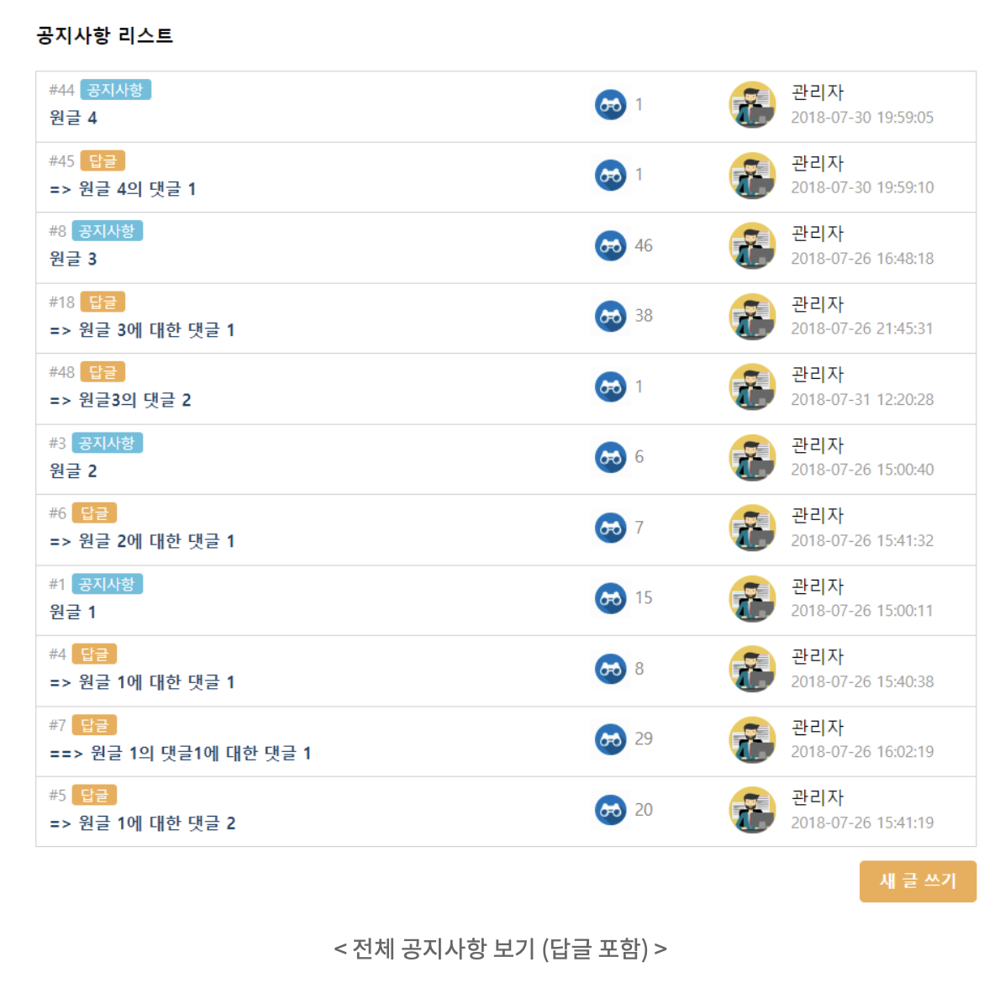
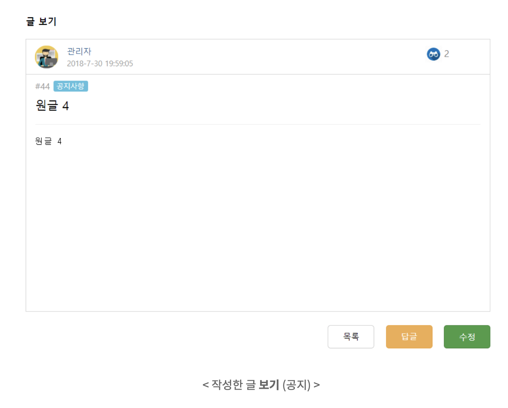
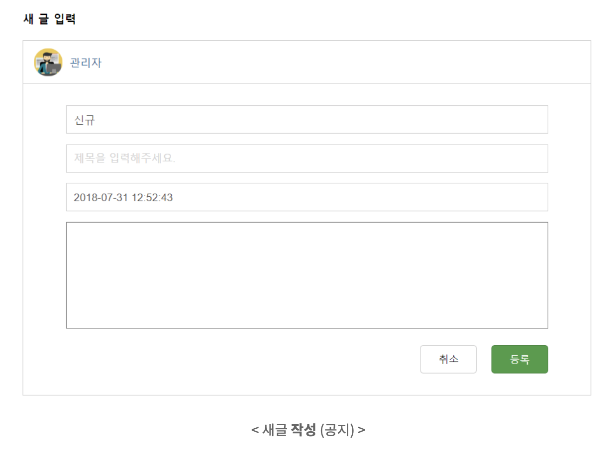
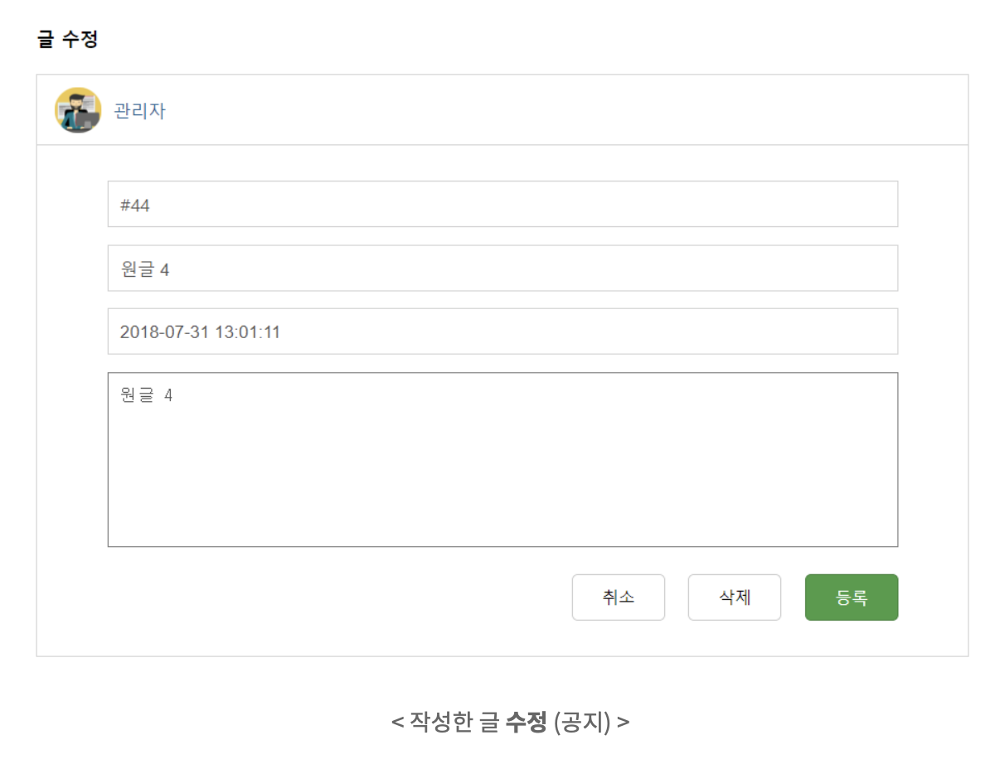
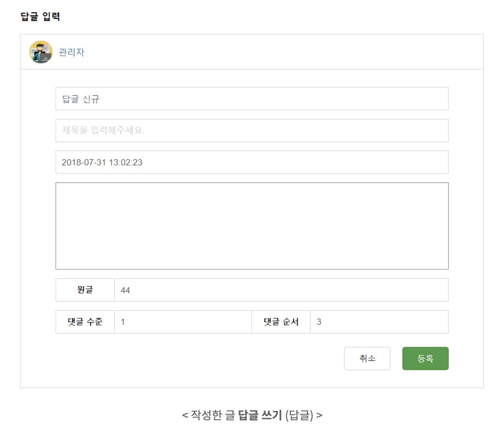
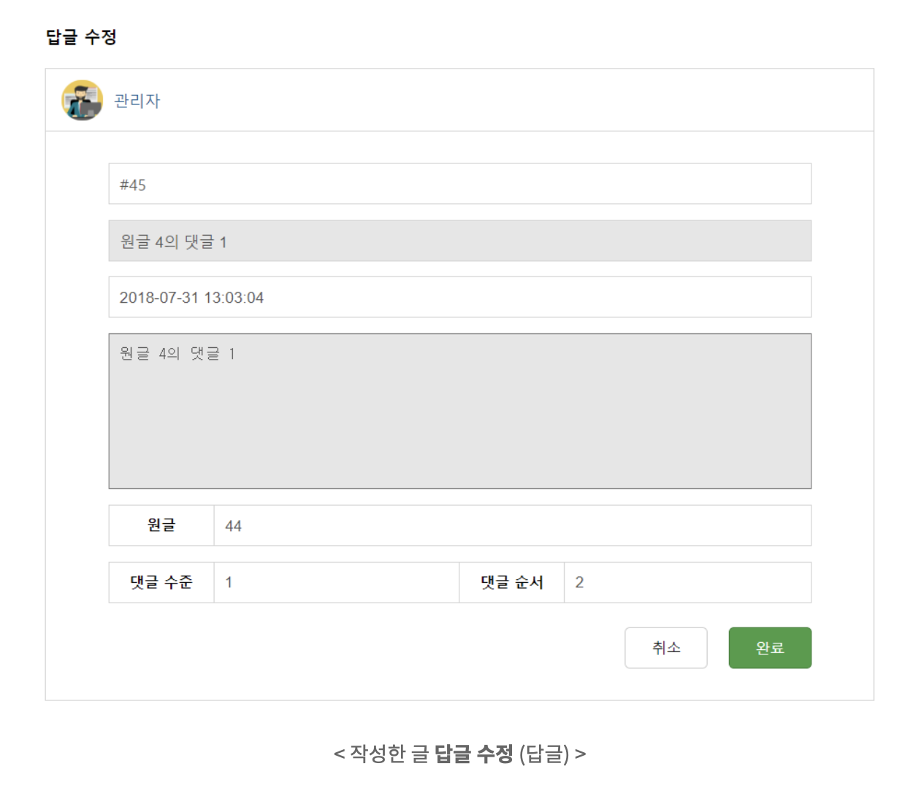
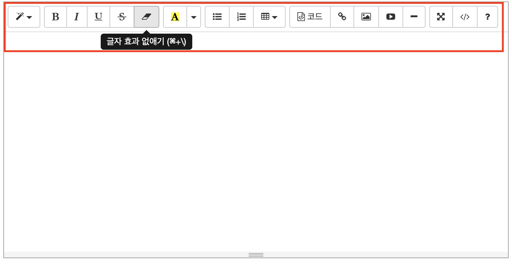

# 요구사항 정의

## 목표
- i. 성공적으로 CRUD 게시판을 만드는 것
- ii. Spring의 기본 동작 과장을 이해하는 것
- iii. Github을 이용한 형상관리에 익숙해지는 것
- iv. 프로젝트를 문서를 꼭 남길 것.
   - 문제를 겪었던 상황과 해결 과정을 남기는 것이 가장 중요하다.

   
## 게시판 요구사항

- 게시글 전체 조회
- 게시글 단건 조회
- 게시글 등록
- 게시글 수정/삭제
- 개별 게시글에 대한 댓글 등록
- 개별 게시글에 대한 댓글 수정

### 1. 게시글 전체 조회

    

댓글이 보이는 구조는 위처럼 전체 조회에서 보여도 되고, 게시글 단건 조회에서 보여도 된다. 개인이 선택해서 하자.

### 2. 게시글 단건 조회

    

### 3. 게시글 등록

    

### 4. 게시글 수정/삭제

    

### 6. 개별 게시글에 대한 댓글 등록

    

 
 
### 7. 개별 게시글에 대한 댓글 수정

    

 

위에 정의된 요구사항은 **최소 조건**이다. 추가로 더 하고 싶은 게 있으면 해도 된다. 게시판이라는 게 추가하고자 하면 끝도 없다.

### 기본 테이블 정의

- board
   - 게시일시
   - 수정일시
   - 조회수
   - 게시글 제목
   - 게시글 내용
- reply
   - 댓글 순서
   - 댓글 작성일시

두개의 테이블을 기본으로 포함하여 각자 설계하자. 요구조건에 user는 없다. 단순 게시글, 댓글만 있을뿐이다. 
 
이번 프로젝트에서는 테이블 설계 할 때 테이블 간의 관계에 foreign_key를 걸지 않고 진행한다. 예를 들어 `board 테이블`에 `user 테이블`의 user_id가 있어도 foreign_key를 걸지 않고 사용한다. 
 

## +a (여유가 남으면 해보자)

- user 테이블을 설계하자. user와 board, reply 간의 매핑 관계를 고민하고 구현해보자.
- 로그인
- 게시글 태깅 시스템
- 게시글 검색
- 게시글 본문 작성 폼 라이브러리

    

 

게시글 본문 작성 폼 라이브러리가 존재한다. 우리가 알고 있는 멋진 게시판처럼 자유자재로 본문을 작성할 수 있도록 해보자.